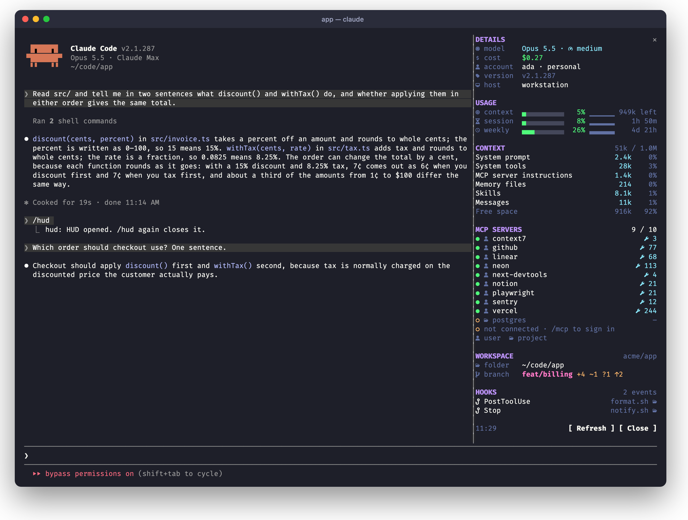
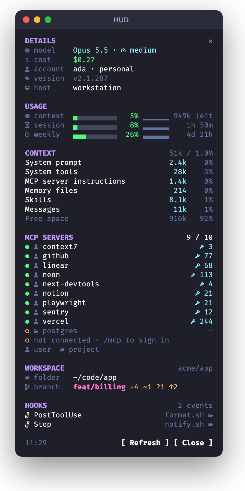

# hud

**A heads-up display for your Claude Code session.** Type `/hud` and a side pane opens
with everything about the run at a glance: model and effort, cost, usage limits, what's
filling the context window, which MCP servers are connected, your branch, and the hooks
your settings run. Type `/hud` again to close it.

[](LICENSE)




## Why

Claude Code knows a lot about your session, but it's spread across `/cost`, `/context`,
`/mcp`, `/status` and your settings files. The HUD puts it in one place that stays open
while you work, so you can see the context filling up, catch an MCP server that never
connected, or check how close you are to the 5-hour limit, without running a command and
losing your place.

## Install

The plugin's hooks are a TypeScript module, so Claude Code loads it from a folder. Clone
it:

```bash
git clone https://github.com/smarchetti/claude-hud ~/.claude/plugins-local/claude-hud
```

Then add the folder to `CLAUDE_CODE_PLUGIN_DIRS` in `~/.claude/settings.json`, so every
session loads it, the desktop app's included:

```json
{ "env": { "CLAUDE_CODE_PLUGIN_DIRS": "~/.claude/plugins-local/claude-hud" } }
```

Start a new session and type `/hud`.

To try it in one session without changing your settings:

```bash
claude --plugin-dir ~/.claude/plugins-local/claude-hud
```

To update, `git pull` in the folder. The next session picks it up.

<details>
<summary>Installing from the marketplace</summary>

The repo is also laid out as a plugin marketplace:

```
/plugin marketplace add smarchetti/claude-hud
/plugin install hud@hud
```

That route hasn't been tested with a hooks module like this one yet, so the folder
install above is the one to use.

</details>

### Requirements

- **Claude Code with plugin hooks modules.** Built and tested on v2.1.287.
- **A [Nerd Font](https://www.nerdfonts.com) in your terminal** for the icons. Without
  one they show as boxes or blanks and everything else still works. The screenshots use
  FiraCode Nerd Font.
- **`git`** on your `PATH` for the workspace section.

## What it shows



**Details.** The model and the effort it's running at, what the session has cost so far,
the account you're signed in with, the Claude Code version, and the host.

**Usage.** The context window and your 5-hour and weekly limits, one line each: a bar that
turns orange at 60% and red at 85%, a sparkline of the last few readings, and how much is
left or how long until the limit resets.

**Context.** Each `/context` category with its tokens and its share of the window. Deferred
tool schemas and the autocompact buffer are left out, since they don't fill the window.

**MCP servers.** Connected servers first, with their tool counts, then the ones you've
configured that aren't connected, so a server that failed to start or needs a sign-in
stands out. The icon beside each says where it's configured: your user config, the
project's `.mcp.json`, your local project config, a plugin, or a claude.ai connector.

**Workspace.** The repo, folder and branch, with staged (`+`), modified (`~`) and untracked
(`?`) files, commits ahead (`↑`) and behind (`↓`) its upstream, and whether you're in a
worktree.

**Hooks.** Each hook event your settings run something on, what runs (a script by its file
name, a prompt or agent hook by its type), and which settings file it's in.

<br clear="right">

## How it works

The HUD refreshes when you open it, on each prompt, every 30 seconds, and when you press
**Refresh**. Effort updates as soon as a model request goes out, so `/effort` shows up
right away.

| Section | Where it comes from |
| --- | --- |
| Details | The session (model, cost, version), the effort on the last model request, `~/.claude.json` (account), `hostname` |
| Usage | The session's usage: context and rate limits |
| Context | The session's context breakdown, a local estimate with no API calls |
| MCP servers | The tools the model can call right now, and server names from `~/.claude.json` and `.mcp.json` |
| Workspace | `git status`, `git rev-parse` and `git remote` in the session's folder |
| Hooks | Your user, project and local `settings.json` |

### What it reads, and what it doesn't

The HUD reads **names, never contents**, from your config files. An MCP server's entry can
hold a token in its headers or environment, and the pane never sees it: it reads the keys
of `mcpServers` and nothing under them. It doesn't open `~/.claude/.credentials.json`
either, which is why a personal account shows as `personal` rather than its plan.

Nothing leaves your machine. The HUD makes no network requests, and everything it draws
comes from the session, your config files, `git` and `hostname`.

## Troubleshooting

**The icons are boxes or missing.** Your terminal isn't using a Nerd Font. Install one
from [nerdfonts.com](https://www.nerdfonts.com) and select it in your terminal's settings.

**Every MCP server shows as not connected.** Servers connect in the background when a
session starts. Send a prompt or press **Refresh**, and any that are still `○` need
attention in `/mcp`.

**There's no effort next to the model.** It appears with the first model request, so it's
blank in a brand new session until you send a prompt.

**The context section shows a dash.** The context breakdown fills in after the model's
first response.

**`/hud` isn't a command.** Check that the folder is in `CLAUDE_CODE_PLUGIN_DIRS` and start
a new session. `claude plugin list` shows `hud` as loaded when it is.

## Develop

```bash
claude plugin validate .   # what the module hooks and calls, and anything the engine would refuse
claude plugin test .       # tests/*.test.ts against the engine, on the terminal and desktop surfaces
tsc -p .                   # after one load has written .claude-plugin/types/
```

In a session that loads the folder, saving a file reloads the plugin; close and reopen the
pane with `/hud` to see the change.

```
hooks/register.tsx   the plugin: the /hud command, the refresh, and the pane
types/index.d.ts     what the pane draws from
tests/hud.test.ts    the pane on the terminal and desktop surfaces, against fake session data
```

The colors are [Dracula](https://draculatheme.com)'s.

## License

[MIT](LICENSE)
